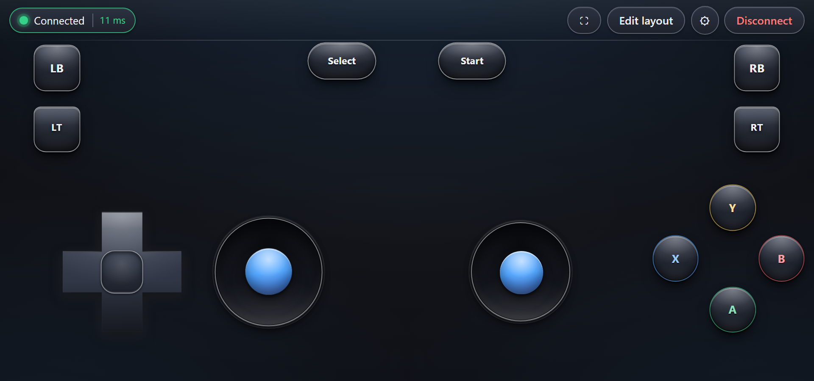
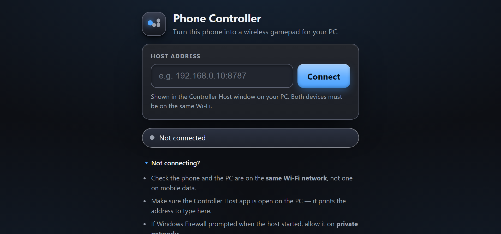
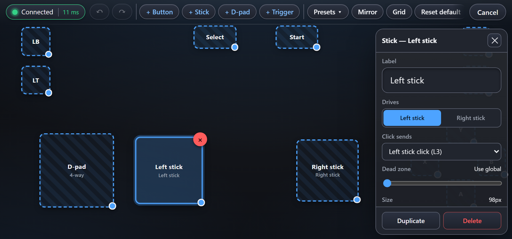
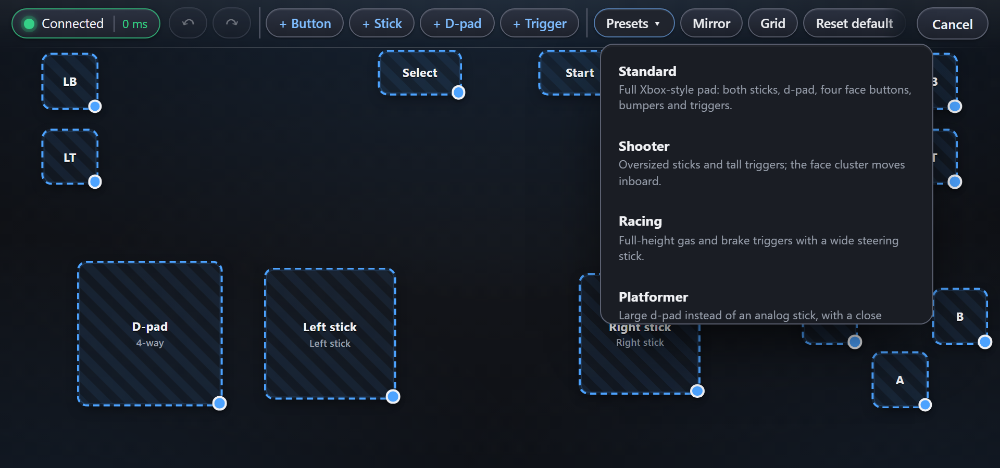
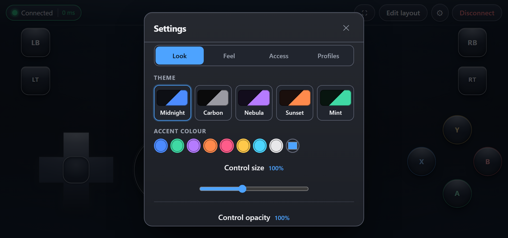
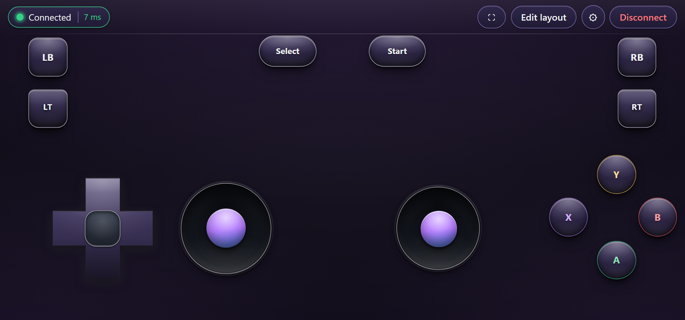
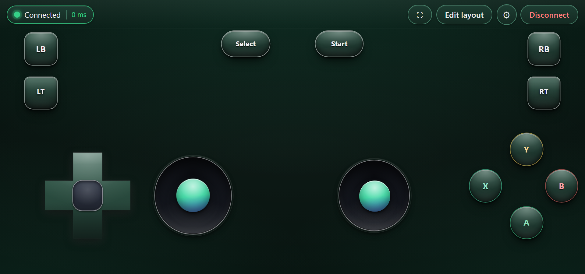
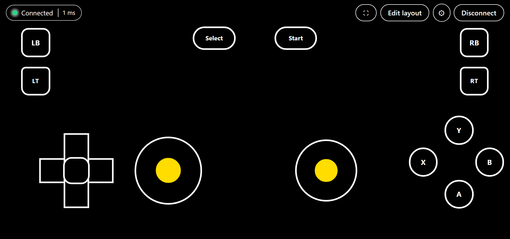

# Phone Controller

**Turn your phone into a real Xbox controller for your PC — over Wi-Fi, with nothing to install on the phone.**

The phone runs a touch gamepad in its browser. The PC runs a small host app that receives the input and injects it as a genuine XInput device through [ViGEmBus](https://github.com/ViGEm/ViGEmBus). Games see an Xbox 360 controller — not a keyboard emulator, not a mouse macro. Steam sees it. Your games see it.

<p align="center">
  
</p>

---

## Why this exists

Every phone-as-gamepad tool asks you to install an app on the phone, sign in, or pair over Bluetooth. This one doesn't. Start one program on the PC, open one address on the phone, and play. The phone never installs anything — it's a web page.

---

## Getting started

### Just want to play? (recommended — works on any Windows PC, nothing to install but one driver)

The app ships as a **portable build**: one `.exe` and a folder of static files. No Node.js, no Rust, no build step, on the PC you're actually going to play on.

1. Install [ViGEmBus](https://github.com/ViGEm/ViGEmBus/releases) (the driver that creates the virtual controller — this is the only thing that has to be installed, and only once per PC).
2. Build `PhoneController-Portable.zip` (30 seconds, see below) and copy that one file to the PC you want to play on — a USB stick, cloud drive, or a chat app all work fine, it's under 10 MB.
3. Unzip it anywhere, double-click **`controller-host.exe`**.
   - Windows will likely show a **"Windows protected your PC"** SmartScreen prompt the first time, because the exe isn't code-signed. Click **More info → Run anyway**. That's expected for an app shared this way, not a sign anything is wrong.
4. A window opens showing an address. Open it in your phone's browser.

That's it. The page connects itself — there's nothing to type.

<p align="center">
  
</p>

> Both devices must be on the same Wi-Fi. If Windows Firewall prompts on the first run, allow it on **private networks**.
> To type the address manually instead, the host window shows that too.

**Add it to your home screen** from your browser's menu and it opens fullscreen like a native app, remembering your layouts and settings.

**Building the portable zip yourself** (needs Node.js + Rust on the *building* machine only — not on the machine you'll play on):

```powershell
powershell -ExecutionPolicy Bypass -File .\Package-Release.ps1
```

This produces `PhoneController-Portable.zip` in the repo root. Copy that one file to any Windows PC, and steps 2–4 above are all that PC ever needs.

### Building from source and running directly (for developers)

If you have Node.js and Rust installed and want to build-and-run in place rather than produce a portable zip:

1. Install [ViGEmBus](https://github.com/ViGEm/ViGEmBus/releases).
2. Double-click **`Start-Controller.bat`**.

The first run builds the client and the host (a few minutes); every run after that just launches. If this reports Node.js or Rust as "not found" right after you installed them, see [Troubleshooting](#troubleshooting) below — it's almost always a stale PATH, not a bad install.

---

## Features

### Every control is editable

Tap **Edit layout**, then tap any control to open its properties. Move it, resize it, recolour it, change its shape — and **remap it to any of the 14 gamepad inputs**. Sticks get their own dead zone, so movement can stay forgiving while aim stays tight.

<p align="center">
  
</p>

The editor has undo/redo (`Ctrl+Z`), snap-to-grid, duplicate (`Ctrl+D`), and a **Mirror** button that flips the whole layout for left-handed play. It's WYSIWYG — controls render at exactly the size they'll be in play.

### Seven layout presets

Start from a layout that already suits the game instead of dragging thirteen controls into place.

<p align="center">
  
</p>

| Preset | Built for |
| --- | --- |
| **Standard** | A full Xbox-style pad |
| **Shooter** | Oversized sticks, tall triggers, face cluster inboard |
| **Racing** | Full-height gas and brake, wide steering stick |
| **Platformer** | Large d-pad instead of an analog stick |
| **Large targets** | Fewer, much bigger, widely spaced controls |
| **Minimal** | D-pad and two buttons, for retro games |
| **Left-handed** | The standard layout mirrored |

### Profiles

Each profile is a complete layout. Keep a shooter layout and a racing layout side by side and switch between them from the bar at the top. Profiles can be renamed, duplicated, exported to a file and imported back.

### Themes and feel

Five themes, a free-form accent colour, and control size, opacity and labels all adjustable. Vibration strength, stick dead zone and sensitivity curve are yours to tune.

<p align="center">
  
</p>

<p align="center">
  
  
</p>

### Built for accessibility, not retrofitted with it

- **Fully keyboard operable.** Every control, the editor, the properties panel and the settings dialog work without a touchscreen — arrow keys drive the sticks, d-pad and triggers.
- **High-contrast mode** that genuinely flattens every decorative layer, on every theme.
- **Toggle mode** per button: press once to hold, press again to release.
- **Reduce motion**, honouring both the app setting and the OS preference.
- Every touch target clears WCAG 2.2's 24px minimum; UI boundaries clear 3:1 contrast.

<p align="center">
  
</p>

### Details that matter in a game

- **100 Hz input**, sent as a fixed 15-byte binary frame — no JSON parsing in the hot path.
- **Live latency readout** in the top bar, so "it feels laggy" has an actual number attached.
- **Heartbeat detection.** A phone that walks out of Wi-Fi range produces no TCP reset, so the socket would sit open and the UI would keep claiming "Connected". A ping/pong heartbeat catches that and reconnects.
- **Nothing gets stuck.** Rotating the phone, opening settings, switching profiles or disconnecting all release held inputs and flush a neutral frame first — because the host keeps applying the last frame it received, so "stop sending" is not the same as "release".
- **Screen wake lock**, so the phone doesn't dim mid-game.
- Multi-touch throughout, with per-control pointer ownership so a stray thumb can't release a button someone else is holding.

---

## Checking that it works

The host window has a live input monitor — press something on the phone and the buttons light up, the stick dots move, the trigger bars fill.

> **Windows' own "Game controllers" panel (`joy.cpl`) will not show it moving.** That panel reads the legacy DirectInput API, which Xbox-type controllers — real ones included — don't report through. It is not a sign that anything is wrong. Games and Steam read XInput and see the pad correctly.

---

## Requirements

**To play** (the portable build): Windows with [ViGEmBus](https://github.com/ViGEm/ViGEmBus/releases) installed. Nothing else.

**To build** (either the portable zip or running from source): [Node.js](https://nodejs.org) and [Rust](https://rustup.rs), only on the machine doing the building. Never on the machine you're playing on.

---

## Troubleshooting

### "Node.js/Rust was not found" right after installing it

This is almost always a **stale PATH**, not a broken install. Installing Node.js or Rust updates an environment variable, but every program that was already running — including File Explorer, and therefore every window it opens when you double-click a `.bat` file — keeps the PATH it started with. Windows doesn't push the update into running programs.

`Start-Controller.bat` already re-reads the current PATH before checking anything, so a stale Explorer session usually isn't a problem. If it still reports a tool missing:

1. Close the window and **open a brand new Command Prompt**, then run the `.bat` from there.
2. If that still fails, **restart your PC once** — this always picks up a PATH change, no exceptions.
3. Confirm the install actually landed: open a new Command Prompt and run `where node` / `where cargo`. If neither prints a path, the install itself didn't complete — reinstall from [nodejs.org](https://nodejs.org) / [rustup.rs](https://rustup.rs).

### Rust fails to build with a linker error

Rust on Windows needs the **Desktop development with C++** workload from the Visual Studio Build Tools to link native code. `rustup` normally prompts to install this the first time you build; if that was skipped, get it from [visualstudio.microsoft.com/visual-cpp-build-tools](https://visualstudio.microsoft.com/visual-cpp-build-tools/).

### None of this should matter for the person actually playing

If you're setting this up for someone else, don't make them deal with any of the above — build `PhoneController-Portable.zip` yourself (see [Getting started](#getting-started)) and just send them that. It needs nothing but ViGEmBus.

---

## How it works

```
  Phone (browser)                          PC
 ┌────────────────┐                ┌────────────────────┐
 │  Touch gamepad │  15-byte       │  WebSocket server  │
 │       PWA      │  frames  ──────▶       :8787        │
 │                │  @ 100 Hz      │         │          │
 │                │                │         ▼          │
 │                │  ◀──────       │  ViGEmBus driver   │
 │                │  page + pong   │         │          │
 └────────────────┘                │         ▼          │
                                   │  Virtual Xbox 360  │
                                   │   pad → your game  │
                                   └────────────────────┘
```

The host also serves the phone page itself over HTTP on `:8788`, which is what removes the install step and the manual IP entry. If either port is already taken, it detects that and moves to the next one rather than silently sharing it.

### Repository layout

```
client/                phone PWA — Vite + TypeScript, no UI framework
host/                  Windows host — Tauri + Rust: gamepad injection and page server
protocol/              the binary frame layout both sides implement
Start-Controller.bat    build-and-run from source (developers)
Package-Release.ps1     build the portable zip (see Getting started)
```

### Developing

```bash
cd client && npm run dev          # phone app with hot reload on :5173
cd host/src-tauri && cargo run    # host app
```

After changing client code, `npm run build` in `client/` refreshes what the host serves.

---

## Out of scope, deliberately

No macros, no rapid-fire, no aim assist. This is a controller, not an advantage.

## Licence

MIT
