# Phone Controller

**Turn your phone into a real Xbox controller for your PC — over Wi-Fi, with nothing to install on the phone.**

The phone runs a touch gamepad in its browser. The PC runs a small host app that receives the input and injects it as a genuine XInput device through [ViGEmBus](https://github.com/ViGEm/ViGEmBus). Games see an Xbox 360 controller — not a keyboard emulator, not a mouse macro. Steam sees it. Your games see it.

<p align="center">
  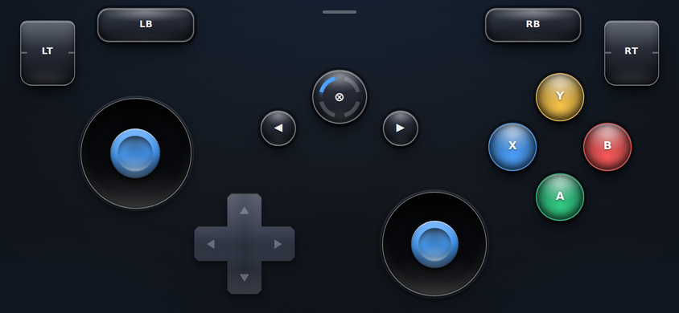
</p>

---

## Why this exists

Every phone-as-gamepad tool asks you to install an app on the phone, sign in, or pair over Bluetooth. This one doesn't. Start one program on the PC, open one address on the phone, and play. The phone never installs anything — it's a web page.

---

## Getting started

### Just want to play? (recommended)

Download one of these from the [latest release](../../releases/latest) — or from the **Actions → Windows build** run of any commit, which builds them for you:

| File | What it is |
| --- | --- |
| **`Phone Controller_<version>_x64-setup.exe`** | The installer. One Windows permission prompt, and it does every setup step: installs the app with Start menu and desktop shortcuts, installs the ViGEmBus gamepad driver if it's missing, and lets phones on your network through Windows Firewall. |
| **`PhoneController.exe`** | Portable — a single file, nothing to unzip (the phone page is built into it). Put it anywhere and double-click it. |

Then:

1. Start **Phone Controller**. Windows may show **"Windows protected your PC"** the first time, because the exe isn't code-signed — click **More info → Run anyway**.
   - Used the portable exe and don't have the driver yet? The window says so and has an **Install driver** button: approve the prompt, click through the installer, and the controller plugs itself in — no restart.
2. Point your phone's camera at the **QR code** in the window. The page opens and connects by itself.

That's the whole setup. The app also **starts with Windows** and sits in the system tray (both switchable in its window), so from then on you just open the page — or the Home Screen icon — on your phone and play. Closing the window keeps it running in the tray; **Quit** in the window or the tray menu stops it.

> Both devices must be on the same Wi-Fi. If the phone can't connect, click **Fix firewall** in the window — it replaces whatever Windows decided on its first-run prompt (pressing *Cancel* there silently blocks the app) with a rule that lets in devices on your own network only.

### Play fullscreen: add it to your Home Screen

Opened from Safari or Chrome, the browser's address bar and toolbar eat the top and bottom of the screen — exactly the space a landscape gamepad wants. Added to your Home Screen, the same page launches standalone with no browser chrome at all, and connects itself on open.

The app offers this to you the first time you connect, and it's always available under **Settings → Look → "Play fullscreen — add to Home Screen"**. On iOS: **Share → Add to Home Screen**. On Android: **menu → Install app**.

**One catch worth knowing about, which the app handles for you.** A Home Screen icon pins the exact address it was made from. The obvious one — `http://192.168.x.x:8788` — belongs to a DHCP lease, so the day your router hands the PC a different IP, the icon opens a page that no longer exists.

So the host also advertises a **permanent address**: `http://<your-pc-name>.local:8788`. That name follows the machine whatever its IP becomes — Windows answers for it over mDNS, and iOS resolves it through Bonjour. Before you make the shortcut, the app checks your phone can actually reach that name and offers to move you there, carrying your layouts and settings across (they're stored per address, so it hands them over rather than leaving them behind). The host window shows the permanent address too.

If your network blocks mDNS — some guest networks and access points with client isolation do — the app simply doesn't make the offer, and says the shortcut is tied to the current IP. Nothing breaks; you just remake it if the address ever changes.

> Offline caching needs a secure origin, which a plain `http://` LAN address isn't, so the app always loads fresh over Wi-Fi rather than from a cache. Harmless here — your phone is on the same network as the host by definition.

**Building the downloads yourself** (needs Node.js + Rust on the *building* machine only — not on the machine you'll play on):

```powershell
powershell -ExecutionPolicy Bypass -File .\Package-Release.ps1
```

This puts `PhoneController.exe` and the installer in `release\`. Pushing to GitHub does the same in the cloud: the **Windows build** workflow uploads both as an artifact on every push to `main`, and attaches them to a GitHub Release when you push a tag like `v1.5.0`.

### Building from source and running directly (for developers)

If you have Node.js and Rust installed and want to build-and-run in place rather than produce the downloads:

1. Double-click **`Start-Controller.bat`**.
2. If the window says the driver is missing, click **Install driver**.

The first run builds the client and the host (a few minutes); every run after that just launches. If this reports Node.js or Rust as "not found" right after you installed them, see [Troubleshooting](#troubleshooting) below — it's almost always a stale PATH, not a bad install.

---

## Features

### Every control is editable

Tap **Edit layout**, then tap any control to open its properties. Move it, resize it, recolour it, change its shape — and **remap it to any of the 15 gamepad inputs, Guide included**. Sticks get their own dead zone, so movement can stay forgiving while aim stays tight.

<p align="center">
  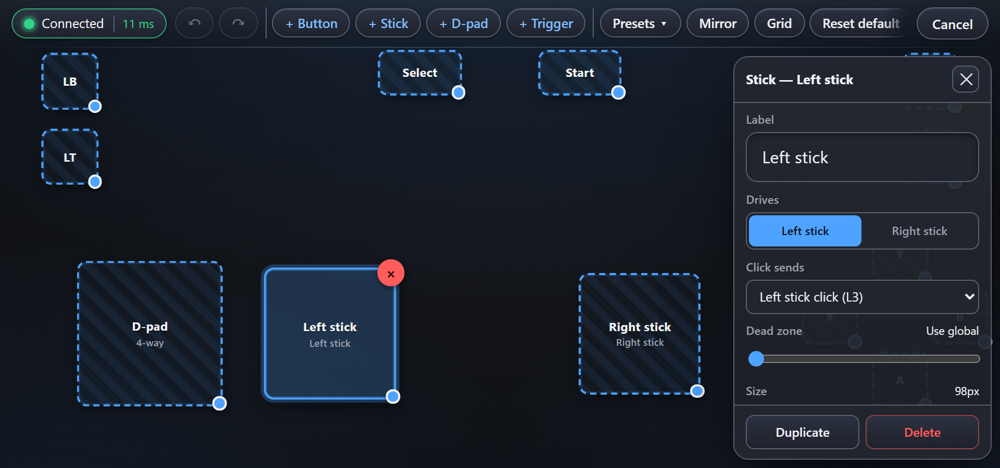
</p>

The editor has undo/redo (`Ctrl+Z`), snap-to-grid, duplicate (`Ctrl+D`), and a **Mirror** button that flips the whole layout for left-handed play. It's WYSIWYG — controls render at exactly the size they'll be in play.

### Controller styles: Xbox 360, Xbox Series, PlayStation, Nintendo

Pick a real controller under **Settings → Look → Controller style** and the pad is laid out like it — stick and d-pad positions, button names and glyphs, d-pad shape and face-button colours:

| Style | What you get |
| --- | --- |
| **Xbox 360** *(default)* | Offset sticks, the one-piece cross d-pad, jewel A/B/X/Y, round ◀ Back / ▶ Start beside the Guide button, and its ring of light showing your player number |
| **Xbox Series** | The same layout with the faceted d-pad and View ⧉ / Menu ≡ |
| **PlayStation** | Symmetric sticks, a split d-pad, the touchpad, Create / Options, the PS button, and △ ○ ✕ □ in their own colours |
| **Nintendo** | Pro Controller layout: B/A/Y/X, L/R, ZL/ZR, − / + up top and a smaller Home below |

Your PC still sees an Xbox controller, so every game works the same: buttons match by **position**, the way Steam maps other pads (the bottom face button always sends A, whether it says A, ✕ or B). Each style becomes its own profile the first time you pick it, so your existing layouts are never overwritten.

<p align="center">
  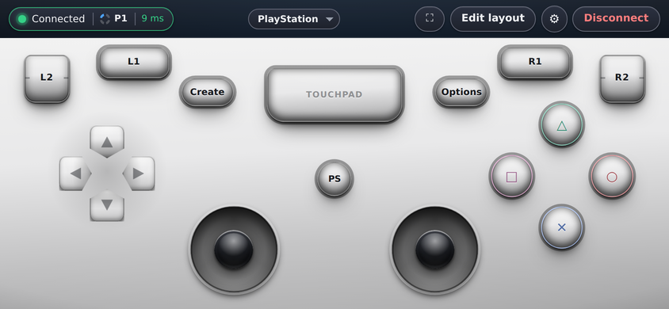
</p>

<p align="center">
  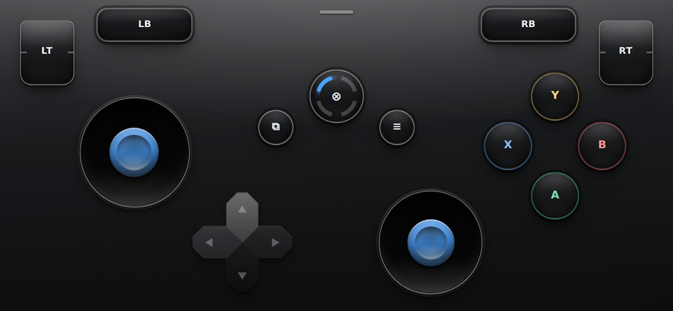
  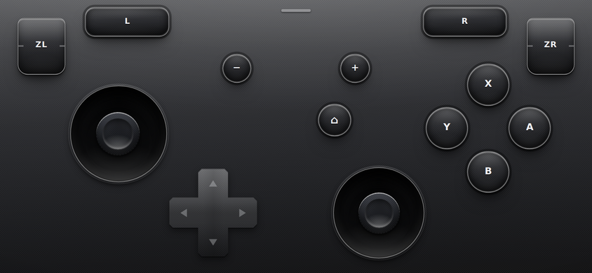
</p>

### Ten layout presets

Start from a layout that already suits the game instead of dragging fifteen controls into place.

<p align="center">
  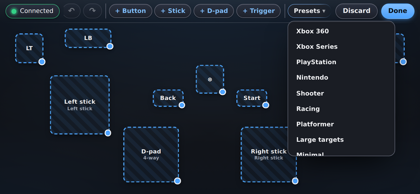
</p>

| Preset | Built for |
| --- | --- |
| **Xbox 360 / Xbox Series / PlayStation / Nintendo** | Each real controller's layout (see above) |
| **Shooter** | Oversized sticks, tall triggers, face cluster inboard |
| **Racing** | Full-height gas and brake, wide steering stick |
| **Platformer** | Large d-pad instead of an analog stick |
| **Large targets** | Fewer, much bigger, widely spaced controls |
| **Minimal** | D-pad and two buttons, for retro games |
| **Left-handed** | The Xbox 360 layout mirrored |

### A top bar that gets out of the way

The bar is a slim strip of icons — status, player number and ping in one chip, then fullscreen, edit, settings and disconnect — and once you start playing it slides away, leaving the whole screen to the pad. Tap the handle at the top edge to bring it back. It stays put in the editor or when the connection needs attention, and **Settings → Look → Top bar → Always show** keeps it on screen.

<p align="center">
  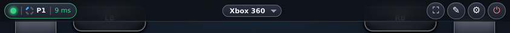
</p>

### Profiles

Each profile is a complete layout. Keep a shooter layout and a racing layout side by side and switch between them from the bar at the top. Profiles can be renamed, duplicated, exported to a file and imported back.

### Make it yours: body colour, finish, buttons, sticks

Build the pad the way a custom-controller designer would:

- **Controller body** — named colourways (Robot White, Carbon Black, Shock Blue, Pulse Red, Electric Volt, Deep Pink, Midnight Purple, Olive Camo, Gold Rush, Glacier Blue) or any colour at all. Legends switch to dark ink on light bodies automatically, so they stay readable.
- **Finish** — nine of them, each lit differently: matte, soft-touch rubber, gloss, spun brushed metal, chrome, carbon fibre twill, smoked crystal, pearlescent and neon.
- **Play surface** — keep the theme's dark backdrop, or paint the *whole screen* as the controller body, so the phone looks like the pad itself.
- **Face buttons** — classic coloured letters, translucent jewel caps, mono, or all in your accent; letters, PlayStation glyphs or dots. Colours follow what a button *sends*, so remapping a button recolours it.
- **Legends** — printed, engraved into the cap, or backlit.
- **Thumbsticks** — concave, domed or pro-grip caps, in accent, body or black.
- **D-pad** — three hard-edged, flat-topped mouldings like the real ones: the one-piece Xbox 360 cross, the Xbox Series cross with its four lit facets, or four separate PlayStation arrow keys.

<p align="center">
  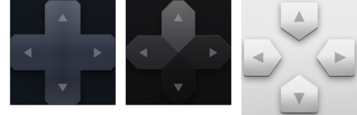
</p>

On top of that: eight themes, a free accent colour, size, opacity, press glow, labels, a per-profile background photo, and **Dim when idle**. Save any combination as a **skin** and reapply it to any profile — or hit **Remix** for a random one.

<p align="center">
  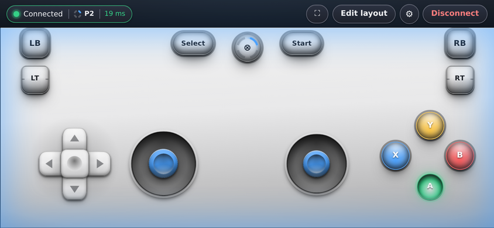
</p>

<p align="center">
  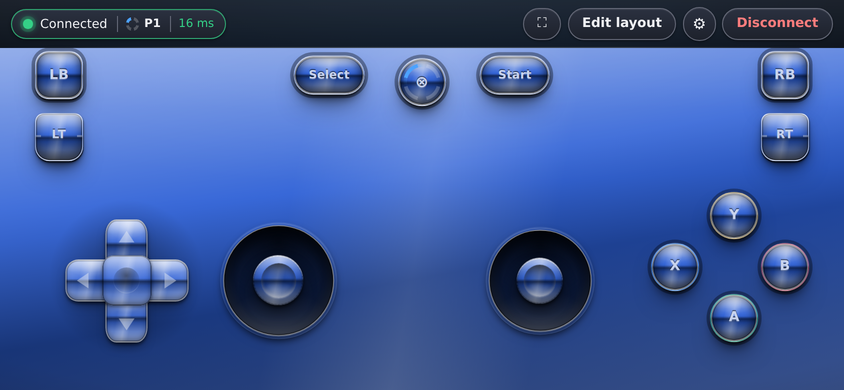
  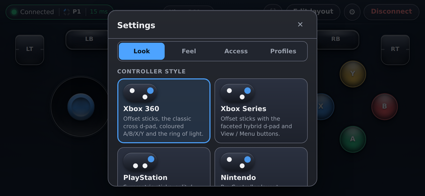
</p>

<p align="center">
  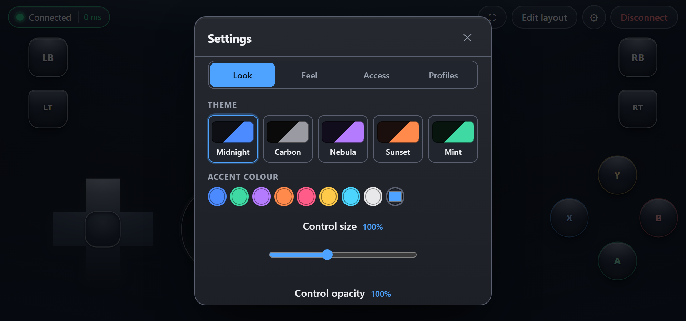
</p>

<p align="center">
  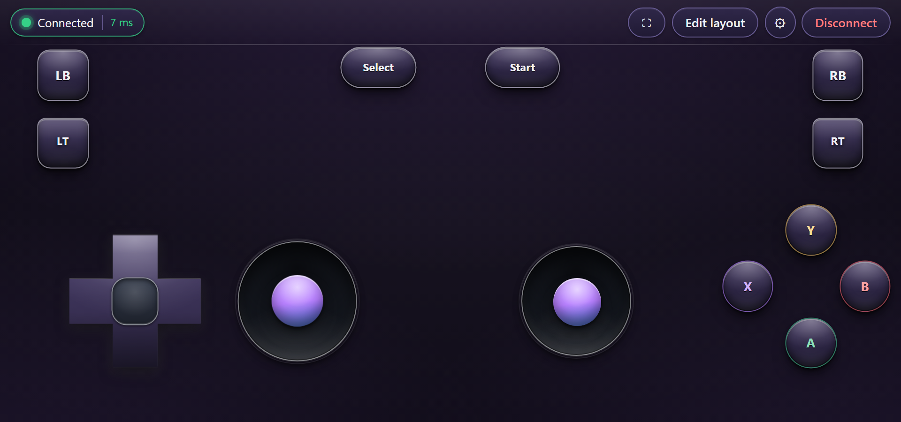
  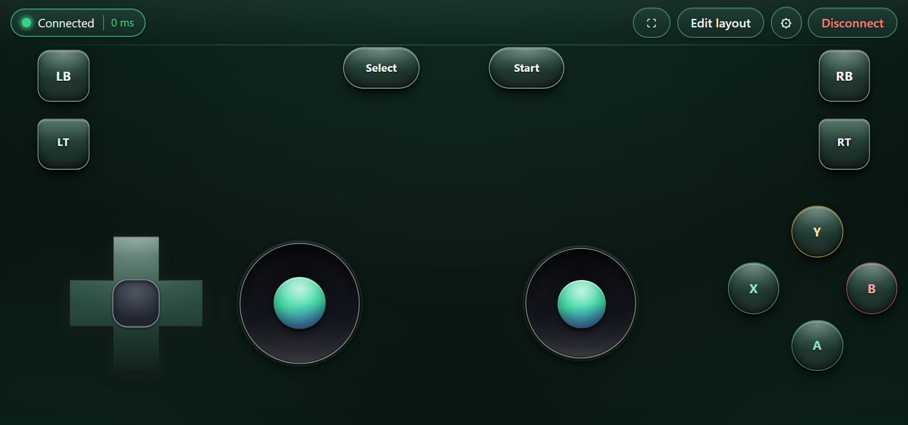
</p>

### Built for accessibility, not retrofitted with it

- **Fully keyboard operable.** Every control, the editor, the properties panel and the settings dialog work without a touchscreen — arrow keys drive the sticks, d-pad and triggers.
- **High-contrast mode** that genuinely flattens every decorative layer, on every theme.
- **Toggle mode** per button: press once to hold, press again to release.
- **Reduce motion**, honouring both the app setting and the OS preference.
- **Pinch-zoom stays available** everywhere except the pad itself, so the connect screen and settings text can be magnified. Locking zoom app-wide is the usual shortcut here, and it fails WCAG 1.4.4 for anyone who needs larger text.
- **A custom accent can't make labels unreadable.** Pick any colour you like; where the accent is used as text it is lightened only as far as 4.5:1 requires, so the hue survives and the words stay legible.
- Every touch target clears WCAG 2.2's 24px minimum; UI boundaries clear 3:1 contrast on all eight themes.

<p align="center">
  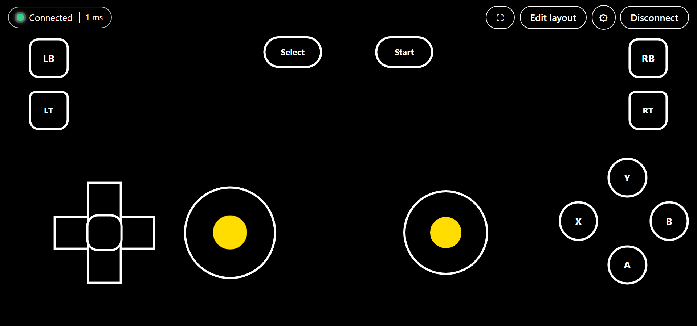
</p>

### Details that matter in a game

- **Game rumble on your phone.** When a game rumbles the controller, the phone vibrates with it, at the strength the game asked for. iPhones can't vibrate from a web page, so the pad's edges pulse with the rumble too — on by default, and it reads as the controller shaking even with the sound off.
- **Player lights.** The Guide button has a ring of light that shows which player slot Windows gave the pad, just like the real one, and the top bar shows P1–P4.
- **The Guide (Xbox) button** works — it reaches Steam's Big Picture and the Xbox Game Bar.
- **Input leaves the phone the instant it changes** (up to 250 frames a second), as a fixed 15-byte binary frame — no JSON parsing in the hot path. While nothing moves it drops to a 20 Hz refresh, a fifth of the old constant 100 Hz, which saves battery and Wi-Fi airtime.
- **Live latency readout** in the top bar, so "it feels laggy" has an actual number attached.
- **Heartbeat detection.** A phone that walks out of Wi-Fi range produces no TCP reset, so the socket would sit open and the UI would keep claiming "Connected". A ping/pong heartbeat catches that and reconnects — at once when the phone wakes up or rejoins Wi-Fi, and within five seconds otherwise.
- **Nothing gets stuck.** Rotating the phone, opening settings, switching profiles or disconnecting all release held inputs and flush a neutral frame first — because the host keeps applying the last frame it received, so "stop sending" is not the same as "release".
- **A dead link releases the pad.** A phone that sleeps or leaves Wi-Fi sends no TCP close, so the host would otherwise sit on its last frame until Windows' keepalive noticed — hours later, with your character still running forward. The host drops a client that goes quiet for six seconds and returns the pad to neutral.
- **Screen wake lock**, so the phone doesn't dim mid-game.
- Multi-touch throughout, with per-control pointer ownership so a stray thumb can't release a button someone else is holding.

---

## Checking that it works

<p align="center">
  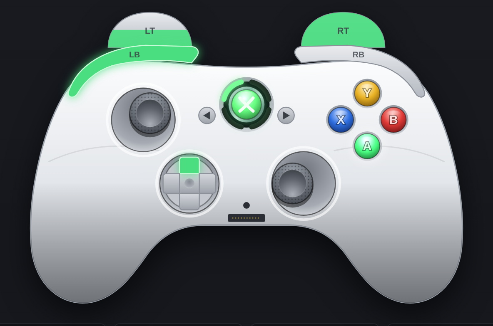
</p>

The window on the PC has a live drawing of the controller — press something on the phone and that button lights up, the sticks move, the triggers fill, and the game's rumble shows on two meters. **Test rumble** buzzes every connected phone, to check vibration without a game. The window walks you through this on first run, and says plainly when the ViGEmBus driver is missing, which is the one failure that otherwise looks like a working connection: the phone connects, reports "Connected", and every press is silently discarded.

> **Windows' own "Game controllers" panel (`joy.cpl`) will not show it moving.** That panel reads the legacy DirectInput API, which Xbox-type controllers — real ones included — don't report through. It is not a sign that anything is wrong. Games and Steam read XInput and see the pad correctly.

---

## Requirements

**To play:** Windows 10 or 11. The installer adds the one driver it needs ([ViGEmBus](https://github.com/nefarius/ViGEmBus/releases)); the portable exe offers to install it with one click. The window itself uses Microsoft Edge WebView2, which Windows 11 and up-to-date Windows 10 already include.

**To build** (the downloads, or running from source): [Node.js](https://nodejs.org) and [Rust](https://rustup.rs), only on the machine doing the building. Never on the machine you're playing on.

---

## Troubleshooting

### "Node.js/Rust was not found" right after installing it

This is almost always a **stale PATH**, not a broken install. Installing Node.js or Rust updates an environment variable, but every program that was already running — including File Explorer, and therefore every window it opens when you double-click a `.bat` file — keeps the PATH it started with. Windows doesn't push the update into running programs.

`Start-Controller.bat` already re-reads the current PATH before checking anything, so a stale Explorer session usually isn't a problem. If it still reports a tool missing:

1. Close the window and **open a brand new Command Prompt**, then run the `.bat` from there.
2. If that still fails, **restart your PC once** — this always picks up a PATH change, no exceptions.
3. Confirm the install actually landed: open a new Command Prompt and run `where node` / `where cargo`. If neither prints a path, the install itself didn't complete — reinstall from [nodejs.org](https://nodejs.org) / [rustup.rs](https://rustup.rs).

### Rust fails to build with a linker error

Rust on Windows needs the **Desktop development with C++** workload from the Visual Studio Build Tools to link native code. `rustup` normally prompts to install this the first time you build; if that was skipped, get it from [visualstudio.microsoft.com/visual-cpp-build-tools](https://visualstudio.microsoft.com/visual-cpp-build-tools/).

### None of this should matter for the person actually playing

If you're setting this up for someone else, don't make them deal with any of the above — send them the installer from a release (or build it with `Package-Release.ps1`). It sets up everything, driver included.

### The address or QR code seems to change, or a typed address won't connect

Only one copy of `controller-host.exe` can meaningfully run at a time — a second launch (easy to trigger by double-clicking it again out of habit, or from a stale shortcut) now just brings the existing window to the front rather than starting a competing copy. Before this was enforced, a second instance would silently fall back to different ports for everything and plug in a second, separate virtual controller, leaving two different addresses in play with no way to tell which one a game was actually reading from — which looked exactly like "the address keeps changing" or "the one I typed doesn't work."

If you're hitting this on a build from before it was fixed: close every "Controller Host" window and check Task Manager for any `controller-host.exe` still running in the background, end them all, then relaunch once.

---

## How it works

```
  Phone (browser)                          PC
 ┌────────────────┐                ┌────────────────────┐
 │  Touch gamepad │  15-byte       │  WebSocket server  │
 │       PWA      │  frames  ──────▶       :8787        │
 │                │  on change     │         │          │
 │                │                │         ▼          │
 │                │  ◀──────       │  ViGEmBus driver   │
 │                │  page, pong,   │         │          │
 │                │  game rumble   │         │          │
 └────────────────┘                │         ▼          │
                                   │  Virtual Xbox 360  │
                                   │   pad → your game  │
                                   └────────────────────┘
```

The host also serves the phone page itself over HTTP on `:8788`, which is what removes the install step and the manual IP entry. If either port is already taken, it detects that and moves to the next one rather than silently sharing it.

### Repository layout

```
client/                phone PWA — Vite + TypeScript, no UI framework
host/                  Windows host — Tauri + Rust: gamepad injection and page server
protocol/              the binary frame layout both sides implement
Start-Controller.bat    build-and-run from source (developers)
Package-Release.ps1     build the portable exe + installer into release\
.github/workflows/      the same build, in the cloud, on every push
```

### Developing

```bash
cd client && npm run dev          # phone app with hot reload on :5173
cd host/src-tauri && cargo run    # host app
```

After changing client code, `npm run build` in `client/` refreshes what the host serves.

---

## Out of scope, deliberately

No macros, no rapid-fire, no aim assist. This is a controller, not an advantage.

## Licence

MIT
