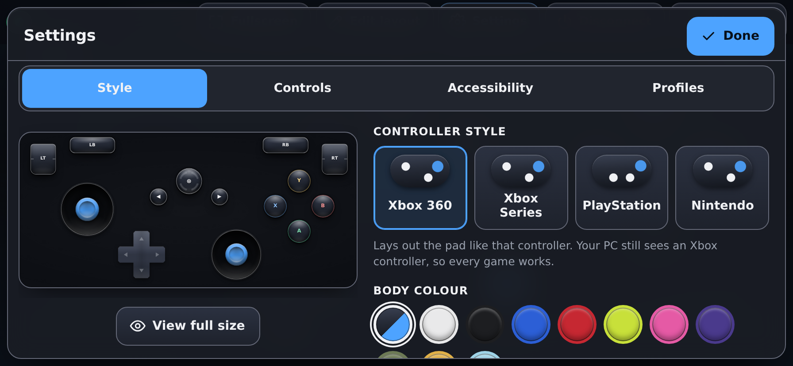

# Phone Controller

**Use your phone as an Xbox controller for your Windows PC — over Wi-Fi, with nothing to install on the phone.**

Your phone shows a touch gamepad in its browser; the PC app turns it into a real Xbox 360 controller that games and Steam see like any other.

  

## How to use

1. **Download and run [PhoneController-Setup.exe](https://github.com/hsassman/controller-app/releases/latest/download/PhoneController-Setup.exe)** on your PC.
   It installs the app, the gamepad driver and the firewall rule in one go.
   If Windows says *"Windows protected your PC"*, click **More info → Run anyway** (the app isn't code-signed).
2. **Open Phone Controller.** A window shows a QR code.
3. **Scan the QR code with your phone's camera.** The phone must be on the same Wi-Fi as the PC. The controller opens and connects by itself.
4. **Turn the phone sideways and play.**

That's it. The app starts with Windows and waits in the system tray, so next time just open the page on your phone.

**Updates install themselves:** when a new version is out, the PC window shows **Update now**. One click installs it over the old one and restarts the app, so there's nothing to download again.

**Tip:** add the page to your Home Screen for fullscreen play (iPhone: **Share → Add to Home Screen**; Android: **⋮ → Install app**). The app offers to do this the first time you connect. From then on, open it from the Home Screen: it connects by itself, and if it ever needs the code again, tap **Scan the code on your PC** — the camera opens over the app and you stay in fullscreen.

**No install?** Download the portable [PhoneController.exe](https://github.com/hsassman/controller-app/releases/latest/download/PhoneController.exe) instead and double-click it. If its window says the driver is missing, click **Install driver**.

All downloads: [latest release](https://github.com/hsassman/controller-app/releases/latest). Needs Windows 10 or 11.

## Troubleshooting

| Problem | Fix |
| --- | --- |
| Scanning the code opens nothing, or the page never loads | Put the phone on the same Wi-Fi as the PC (not mobile data or a guest network), click **Allow through firewall** in the PC window, and turn off any VPN. If the PC has several network adapters, pick another one under the QR code and scan again. |
| Still nothing loads | Your router may keep devices apart ("AP isolation" or "client isolation"), as most work, school, hotel and guest Wi-Fi does. To check, turn on the phone's **Personal Hotspot**, connect the PC to it and scan the new code. If that works, turn off isolation in the router's settings. |
| Connected, but nothing moves in the game | The gamepad driver is missing: click **Install driver** in the PC window. |
| Windows' "Game Controllers" panel (joy.cpl) shows no movement | Normal for Xbox controllers. Check the live drawing in the PC window instead; games read the pad correctly. |
| Where's the menu? | It tucks away while you play. Tap the small bar at the top of the screen to bring it back. |
| No vibration on iPhone | iPhone browsers can't vibrate. The screen edges pulse with the game's rumble instead. |

## Features

- **Real controller styles:** Xbox 360, Xbox Series, PlayStation and Nintendo layouts, with authentic button names, d-pads and colours. Buttons map by position, so every game works.
- **Make it yours:** body colours, nine finishes (matte, soft-touch, gloss, metal, chrome, carbon, crystal, pearl, neon), six thumbstick shapes, four trigger shapes, Guide button styles, PlayStation symbols, themes, your own photo as a background (with filters, brightness and blur) and saved looks, all with a live preview of your controller as you change them.
- **Editable layouts:** move, resize and remap any control; ten presets; multiple profiles, shareable by QR code.
- **Game feedback:** game rumble vibrates the phone, and the Guide button's ring of light shows your player number.
- **Low latency:** input is sent the instant it changes; a slim top bar hides while you play and shows your ping.
- **Easy and accessible:** built to WCAG 2.2 AA. Every menu button is a full 44px target with a plain-word label; it works with screen readers and a keyboard, and has high-contrast mode, press-once-to-hold buttons and reduce motion.

  

  
  

  

  

## Build from source

Needs [Node.js](https://nodejs.org) and [Rust](https://rustup.rs).

- **Run it:** double-click `Start-Controller.bat`.
- **Make the downloads:** `powershell -ExecutionPolicy Bypass -File .\Package-Release.ps1` writes `PhoneController-Setup.exe` and `PhoneController.exe` to `release\`.
- **Develop:** `cd client && npm run dev` for the phone app; `cd host/src-tauri && cargo run` for the PC app.

Every push to `main` also builds both files on GitHub and publishes them as the latest release ([Windows build workflow](https://github.com/hsassman/controller-app/actions/workflows/windows-build.yml)).

`client/` is the phone app (Vite + TypeScript), `host/` the PC app (Tauri + Rust, using the [ViGEmBus](https://github.com/nefarius/ViGEmBus) driver), and `protocol/` the binary format they share.

## Licence

[MIT](LICENSE)
